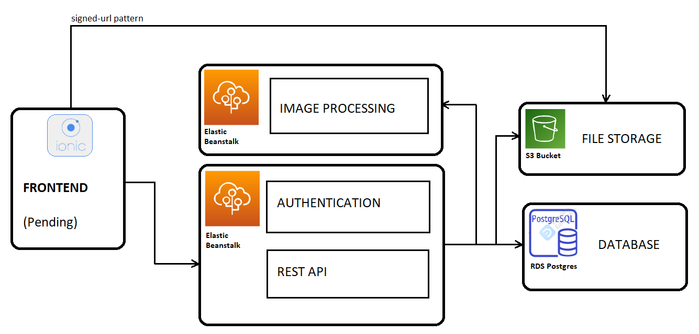

# udagram
Instagram type application in the cloud of AWS

The project  has three main parts deployed in different elements of AWS
* Backend REST API: written in typescript/express (deployed in a elastic beanstalk)
* Backend Processing Imagen: written in TS/Express (deployed in a different elastic beanstalk as a microservice)
* Frontend: PENDING

Appart from that, this application makes usage of the following AWS Services:
* Database: The database is a postgres instance deployed as an RDS service in AWS.
* File storage: As a file storage the application uses S3 buckets to store the images in the cloud.

You can find this app working in URL:
* Backend REST API: http://udagram-ibernal-dev-dev.us-east-1.elasticbeanstalk.com/api/v0/
* Backend Processing image: PENDING
* Frontend: PENDING

## CONTENTS

- [ARCHITECTURE](#ARCHITECTURE)
- [INSTRUCTIONS TO LOCAL INSTALLATION](#INSTRUCTIONS-TO-LOCAL-INSTALLATION)

## ARCHITECTURE

This application uses the following AWS Services:

1) Database is deployed in an RDS Postgres DB
2) Backend REST API is deployed using a Beanstalk for Node applications
3) Backend Image Processing is deployed in a different Beanstalk for Node applications
4) Frontend is served trough an S3 Bucket (PENDING)
5) An additional S3 Bucket is used to provide file storage capabilities for the images.

The architecture diagram is as follows:


## INSTRUCTIONS TO LOCAL INSTALLATION

To download the repository

```bash
./downloads/git clone https://github.com/IsmaelB83/udagram.git
```

1) Then enter in directory restapi, and follow instructions to start the REST API: [BACKEND REST-API](restapi/README.md)
```bash
./downloads/udagram/cd restapi
./downloads/udagram/npm install
./downloads/udagram/npm run dev
```
2) With backend-api up and running, follow instructions to start the IMAGE PROCESSING: [IMAGE PROCESSING MICROSERVICE](imageprocessing/README.md)
```bash
./downloads/udagram/cd imageprocessing
./downloads/udagram/npm install
./downloads/udagram/npm run dev
```
3) With all that you can start the FRONT-END: [FRONT-END](frontend/README.md)
```bash
./downloads/udagram/cd frontend
./downloads/udagram/npm install
./downloads/udagram/npm start
```
