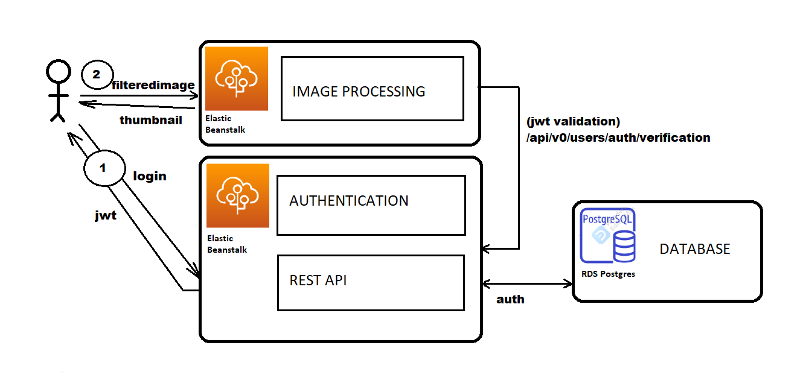

# image-processing
This microservice is in charge of creating thumbnails. For that, it provides the user (or other services) and endpoint that expects a url pointing to an image. The microservice will:
1) Extract the image from the url
2) Create a thumbnail as a local file
3) Send it to the caller and
4) delete it from local files.

The endpoint is secured trough JWT. Nonetheless, as the JWT has not been issued originally by this microservice, it can't validate it's signature. For that, imageprocessing service delegates the JWT validation to the restapi (which originally issued the JWT at login time). For that, this microservice calls the endpoint:
```bash
http://restapi.bernaldev.com/api/v0/users/auth/verification
```
The architecture diagram is as follows:


## INSTRUCTIONS TO LOCAL INSTALLATION

To download the repository

```bash
./downloads/git clone https://github.com/IsmaelB83/udagram.git
```

1) Enter in the imageprocessing folder and run:
```bash
./downloads/udagram/cd imageprocessing
./downloads/udagram/imageprocessing/npm install
```
2) Make a copy of .env.example file to .env (this application relies on .env files to manage configuration). Make sure your AUTH_SERVER variable is pointing to your corresponding RESTAPI server.
```bash
./downloads/udagram/imageprocessing/npm run dev
```

3) With all that make a call to filteredimage with the appropiate bearer token
```bash
{{host}}/api/v0/filteredimage?image_url=https://herofreaks.com/wp-content/uploads/2020/08/Tainted-Grail.jpg
```

(See attached postman collection for more details).
